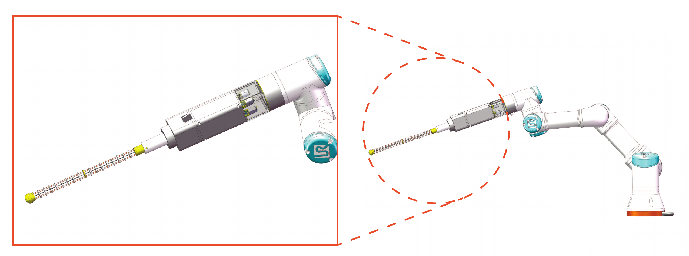
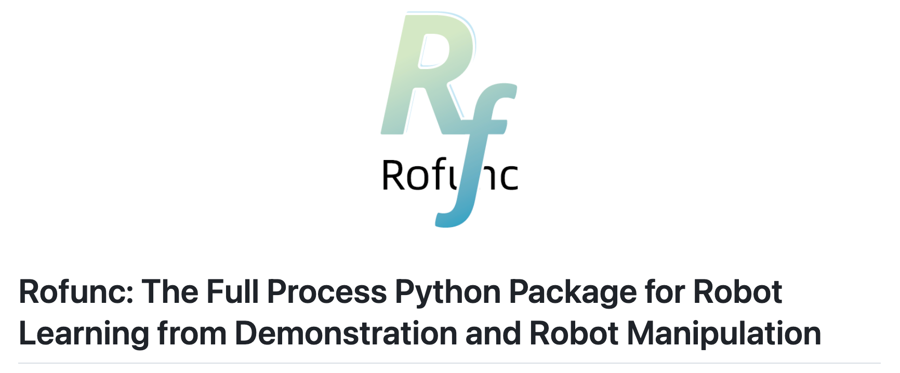

# TendonTrack

Code to reproduce the experiments in [Efficient reinforcement learning control for continuum robots based on Inexplicit Prior Knowledge](https://arxiv.org/abs/2002.11573).




## Installation

1. Install [MuJoCo 1.50](https://www.roboti.us/index.html) at `~/.mujoco/mjpro150` and copy your license key to `~/.mujoco/mjkey.txt`
2. Clone `TendonTrack`

```
git clone https://github.com/Skylark0924/TendonTrack.git
```

3. Create a conda environment and install mbpo

```
cd ipk_mbpo
conda env create -f environment/gpu-env.yml
conda activate ipk_mbpo
pip3b install -e viskit
pip3b install -e .
```

## Usage

The main code of IPK is in `ipk_mbpo` folder.

Configuration files can be found in `ipk_mbpo/examples/config/`. 

**For IPK Tendon Tracking:**

```
ipk_mbpo run_local examples.ipk_development --config=examples.config.custom.IPK --gpus=1 --trial-gpus=1
```

**For MBPO Tendon Tracking:**

```
ipk_mbpo run_local examples.development --config=examples.config.custom.MBPO --gpus=1 --trial-gpus=1
```

**For SAC Tendon Tracking:**

```
ipk_mbpo run_local examples.development --config=examples.config.custom.SAC --gpus=1 --trial-gpus=1
```

**For PILCO version**, you need to fork a second repository [Skylark0924/TendonTrack_PILCO](https://github.com/Skylark0924/TendonTrack_PILCO) and run `python example/gym_tracking_tendon.py` after environment installation.

Currently only running locally is supported.

#### New environments

To run on a different environment, you can modify the provided [template](examples/config/custom/0.py). You will also need to provide the termination function for the environment in [`ipk_mbpo/mbpo/static`](ipk_mbpo/mbpo/static). If you name the file the lowercase version of the environment name, it will be found automatically. See [`hopper.py`](ipk_mbpo/mbpo/static/hopper.py) for an example.

#### Logging

This codebase contains [viskit](https://github.com/vitchyr/viskit) as a submodule. You can view saved runs with:

```
viskit ~/ray_mbpo --port 6008
```

assuming you used the default [`log_dir`](examples/config/halfcheetah/0.py#L7).

#### Hyperparameters

The rollout length schedule is defined by a length-4 list in a [config file](examples/config/halfcheetah/0.py#L31). The format is `[start_epoch, end_epoch, start_length, end_length]`, so the following:

```
'rollout_schedule': [20, 100, 1, 5] 
```

corresponds to a model rollout length linearly increasing from 1 to 5 over epochs 20 to 100. 

If you want to speed up training in terms of wall clock time (but possibly make the runs less sample-efficient), you can set a timeout for model training ([`max_model_t`](examples/config/halfcheetah/0.py#L30), in seconds) or train the model less frequently (every [`model_train_freq`](examples/config/halfcheetah/0.py#L22) steps).

## Reference

If you find this code useful in an academic setting, please cite:

```
@article{liu2020efficient,
  title={Efficient reinforcement learning control for continuum robots based on Inexplicit Prior Knowledge},
  author={Liu, Junjia and Shou, Jiaying and Fu, Zhuang and Zhou, Hangfei and Xie, Rongli and Zhang, Jun and Fei, Jian and Zhao, Yanna},
  journal={arXiv preprint arXiv:2002.11573},
  year={2020}
}
```

If you're interested in reinforcement learning, we encourage you to check out our latest library of reinforcement learning and imitation learning in (humanoid) robotics.

[](https://github.com/Skylark0924/Rofunc)

[](https://pypi.org/project/rofunc/)


[](https://github.com/Skylark0924/Rofunc/issues?q=is%3Aissue+is%3Aclosed)
[](https://github.com/Skylark0924/Rofunc/issues?q=is%3Aopen+is%3Aissue)
[](https://rofunc.readthedocs.io/en/latest/?badge=latest)
[](https://actions-badge.atrox.dev/Skylark0924/Rofunc/goto?ref=main)

> **Repository address: https://github.com/Skylark0924/Rofunc**
